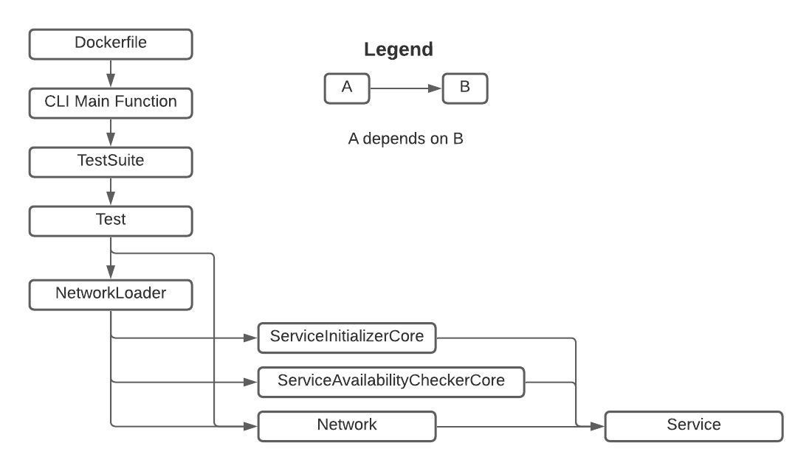

Testsuite
=========
Overview
--------
Every testsuite is simply a Docker image that runs a CLI that executes a test. The test execution logic for the CLI is encapsulated in [a Kurtosis client library in your language of choice](https://github.com/kurtosis-tech/kurtosis-docs/blob/master/supported-languages.md), so your main CLI function will only be a thin layer of arg-parsing, an instantiation of your suite object that contains test and testnet info, and a call to the Kurtosis client's `Client.Run` function. The components required to instantiate a testsuite are as follows:

We recommend you follow along in code as you read this document. Each client library contains an example implementation of the components as well as the ability to bootstrap a new testsuite from the example implementation. The rest of the guide will assume you've bootstrapped a new testsuite, so if you haven't done so already we recommend following the [the quickstart instructions](./quickstart.md) to bootstrap now.

**NOTES:**
* Kurtosis provides clients for writing testsuites in multiple languages. While the languages differ, the objects and function calls are named the same. For consistency, this guide will avoid language-specific idioms and will use pseudocode with a generic `Object.function` notation.
* Each Kurtosis client provides comments on all objects and functions, so this guide will focus on the higher-level interaction between the components rather than specific documentation of each function and argument. For detailed docs, see the in-code comments in your client of choice.

Components
----------
### CLI Main Function
Your Kurtosis testsuite CLI in your repo will be a `main` function that does the following in order:

1. **Arg-Parsing:** Your CLI will receive several Kurtosis-specific arguments, which (with the exception of log level) will in turn be passed as-is to the `Client.run` function. You can also receive custom arguments specific to your testsuite (more on this later).
2. **Set Log Level:** Using the log level arg, set the logging level for the test's execution.
3. **TestSuite Instantiation:** The `Client.run` function needs details about the test logic to run as well as instructions on setting up the network required. These are contained in a `TestSuite` object, whose behaviour can be modified with custom arguments specific to your testsuite.
4. **Test Execution:** Calling `Client.run` with the Kurtosis arguments and `TestSuite` object.

### Dockerfile
To package the CLI into a Docker image, your repo will have a Dockerfile under the example implementation folder that defines how to build the image (and if Dockerfiles are alien to you, we recommend [the official Docker docs](https://docs.docker.com/get-started/) as a great place to start). Kurtosis testsuite Dockerfiles are very simple, and simply compile and run the CLI. 

The only bit of complexity is that the Dockerfile will receive Kurtosis-specific parameters as magic environment variables, which will then be passed to your testsuite CLI in the form of flag args. These environment variables are as follows:

* `KURTOSIS_API_IP`
* `LOG_LEVEL`
* `METADATA_FILEPATH`
* `SERVICES_RELATIVE_DIRPATH`
* `TEST`

With the exception of the log level, all of these will be passed as-is to the `Client.run` call. If you modify the Dockerfile, you will need to make sure that you continue to receive these variables as flags in your CLI main function.

### TestSuite
Every Kurtosis client's `Client.Run` function requires a `TestSuite` object that contains details about:

* Your services - what Docker images to use, what params to give when running the container, how to verify the service is available, etc.
* Your testnets - their topology and what types and quantities of services they're composed of
* Your tests - their names and logic, what testnets they want, their timeouts, etc.

All this information is packaged inside the `Test` object, so a `TestSuite` is really a wrapper class for a set of named `Test`s.

### Test
A `Test` object packages the logic for executing an individual test with a definition of the network the test will execute against. It has three main components:

* A `getNetworkLoader` method for retrieving the `NetworkLoader` that defines the initial state of the testnet
* A `run` function that takes in a `TestContext` for making assertions and a `Network` object that serves as a handle to interacting with the testnet
* Timeouts defining when the test should be marked as failed due to running for too long

### Network
A `Network` object is an entirely user-defined representation of a running testnet wrapped around a `ServiceNetwork`. Its purpose is to provide a layer of abstraction so users can make test-writing as simple as possible. For example, if all your tests want a five-node network, you could write a `FiveNodeNetwork` object that implements the `Network` interface and give it functions like `getNodeOne`, `getNodeTwo`, etc. 

### NetworkLoader
A `NetworkLoader` object is an object used for initializing `Network` instances before a test's execution logic starts running. When implementing a `NetworkLoader`, you should:

1. Use the `configureNetwork` function to give IDs to a set of service configurations which are the templates from which all service instances in the network will be created (requires defining `ServiceInitializerCore` and `ServiceAvailabilityCheckerCore` instances for each configuration)
2. Use the configuration IDs you defined in `configureNetwork` to instantiate several new nodes in `initializeNetwork`
3. Wrap the `ServiceNetwork` object that you initialized in `configureNetwork` with your custom `Network` object in the `wrapNetwork` function

This resulting `Network` object is what `Test.run` will receive.

### ServiceInitializerCore
A `ServiceInitializerCore` provides specific information about how to launch the actual Docker container underlying a given `Service`, for use when defining service configurations in the `NetworkLoader`. This object is very well-documented in code, so we recommend users read the details in their client library of choice.

### Service
Just like the `Network` is an entirely user-defined abstraction of a running testnet to make test-writing easier, so too is the `Service` an entirely user-defined abstraction of a running service. For example, an `ElasticsearchService` implementation might have a `getClient` function that returns an ES client so a test can easily interact with an Elasticsearch service.

### ServiceAvailabilityCheckerCore
To avoid spurious failures, Kurtosis won't start running a test unless its target testnet is running and ready. A `ServiceAvailabilityCheckerCore` implementation tells Kurtosis how to judge whether the services in a testnet are available, so that the testnet won't be marked as ready until every service is.

Running A Testsuite
-------------------
As detailed in [the architecture docs](./architecture.md), testsuite containers are launched, one per test, by the Kurtosis initializer container. The initializer container itself is a sort of "CLI", and the entrypoint into running the Kurtosis platform; however, launching it is nontrivial as it requires several special flags to its `docker run` command. Further, because the initializer is a CLI, it receives its own flags (separate from `docker run`'s flags) to customize its behavior!

This can become very confusing very quickly, so every bootstrapped repo comes with a `build_and_run.sh` script in the `scripts` directory to make building and running your testsuite simple. Run `build_and_run.sh help` inside your bootstrapped repo to display detailed information about how to use this script.

As the script's help text mentions, the execution of the testsuite can be modified by adding additional Docker `--env` flags to set certain Kurtosis environment variables. `build_and_run.sh` already sets the required parameters by default, but the full list of Docker environment variable "parameters" that can be passed to `build_and_run.sh` are listed below for completeness. Any variable you manually set will override the `build_and_run.sh` defaults.

| Parameter     | Required/Optional | Description |
| ------------- | ----------------- | ----------- |
| `CLIENT_ID` | Optional | An Oauth client ID, which should be provided only when running the testsuite on a CI machine |
| `CLIENT_SECRET` | Optional | An Oauth client secret, which should be provided only when running the testsuite on a CI machine |
| `CUSTOM_ENV_VARS` | Optional | A key-value mapping in JSON object form of additional Docker environment variables that should be passed through from the initializer to your testsuite container. For example, if your test suite's Dockerfile expects a `SOME_CUSTOM_ENV_VAR` variable that it then passes to your CLI's main function, you'd add call `build_and_run.sh` with an extra `--env 'CUSTOM_ENV_VARS={"SOME_CUSTOM_ENV_VAR":\ "some value"}'` flag. |
| `DO_LIST` | Optional; default `false` | A boolean variable indicating if Kurtosis should list the names of the tests in the test suite rather than executing any tests. |
| `KURTOSIS_API_IMAGE` | Required | A Docker image from [the Kurtosis API image repo](https://hub.docker.com/repository/docker/kurtosistech/kurtosis-core_api) that the initializer should use during operation. The tag of the API image should match the tag of the initializer image being run. |
| `KURTOSIS_LOG_LEVEL` | Optional; default `debug` | The log level that all output generated by the Kurtosis framework itself should log at. Acceptable values are `trace`, `debug`, `info`, `warn`, `error`, and `fatal`. |
| `PARALLELISM` | Optional; default `2` | A positive integer variable telling Kurtosis how many tests it should run in parallel. **This should be set no higher than the number of cores on your machine, else you'll slow down your tests and potentially hit test timeouts!** |
| `SUITE_EXECUTION_VOLUME` | Required | The name of the Docker volume in which this execution of Kurtosis should store its data. The `build_and_run.sh` script will handle creating a new volume on every execution, but if you're running the initializer manually you should take care to use a new Docker volume on every execution! |
| `TEST_NAMES` | Optional | A comma-separated list of specific test names to run. If this option is not specified, all tests in the test suite are run. |
| `TEST_SUITE_IMAGE` | Required | The name of the Docker image containing your test suite. |
| `TEST_SUITE_LOG_LEVEL` | Optional; default `debug` | A string that will be passed as-is to the test suite container to indicate what log level the test suite container should output at. Kurtosis won't know what logging framework the test suite container uses, so this string should be meaningful to the test suite image. |

**WARNING:** Docker doesn't like unescaped spaces when using the `--env` flag. Make sure you backslash-escape spaces in your environment variable values, like so: `--env TEST_NAMES="my\ specific\ test1"`!

Customizing Testsuite Execution
-------------------------------
You'll very likely want to customize the behaviour of your testsuite based on information passed in when you execute Kurtosis (e.g. have a `--fast-tests-only` flag to your CLI's main function that runs a subset of the tests in your suite). To do so, you'll need to:

1. Add the appropriate flags to your CLI's main function
1. Edit the `Dockerfile` that wraps your testsuite CLI to set the flag using a Docker environment variable (e.g. `--fast-tests-only=${FAST_TESTS_ONLY}`)
1. When running Kurtosis, use the `--env` Docker flag to set the value of the initializer's `CUSTOM_ENV_VARS_JSON` parameter-variable to a JSON map containing your desired values (e.g. `build_and_run.sh all --env CUSTOM_ENV_VARS_JSON="{\"FAST_TESTS_ONLY\":true}"`)

**WARNING:** Docker doesn't like unescaped spaces when using the `--env` flag. You'll therefore want to backslash-escape BOTH spaces and double-quotes, like so: `--env CUSTOM_ENV_VARS_JSON="{\"VAR1\":\ \"var1-value\",\ \"VAR2\":\ \"var2-value\"}"`.

Next Steps
----------
Now that you understand more about the internals of a testsuite, you can:

* Head over to [the quickstart instructions](./quickstart.md) to bootstrap your own testsuite (if you haven't already)
* Visit [the architecture docs](./architecture.md) to learn more about the Kurtosis platform at a high level.
* Check out [the instructions for running in CI](./running-in-ci.md) to see what's necessary to get Kurtosis running in your CI environment
